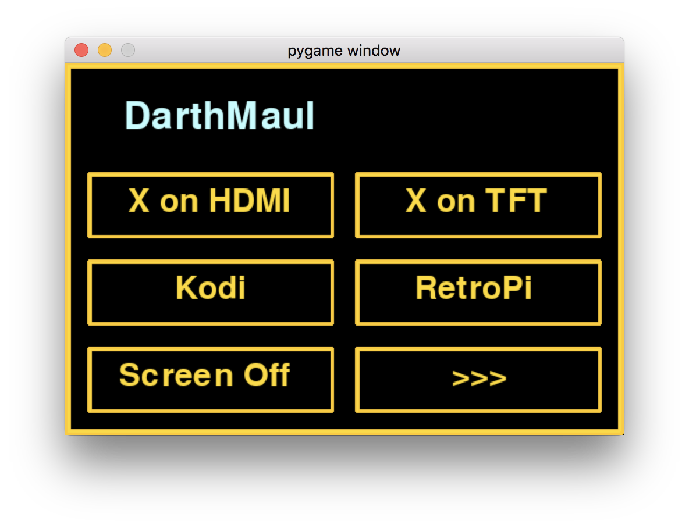
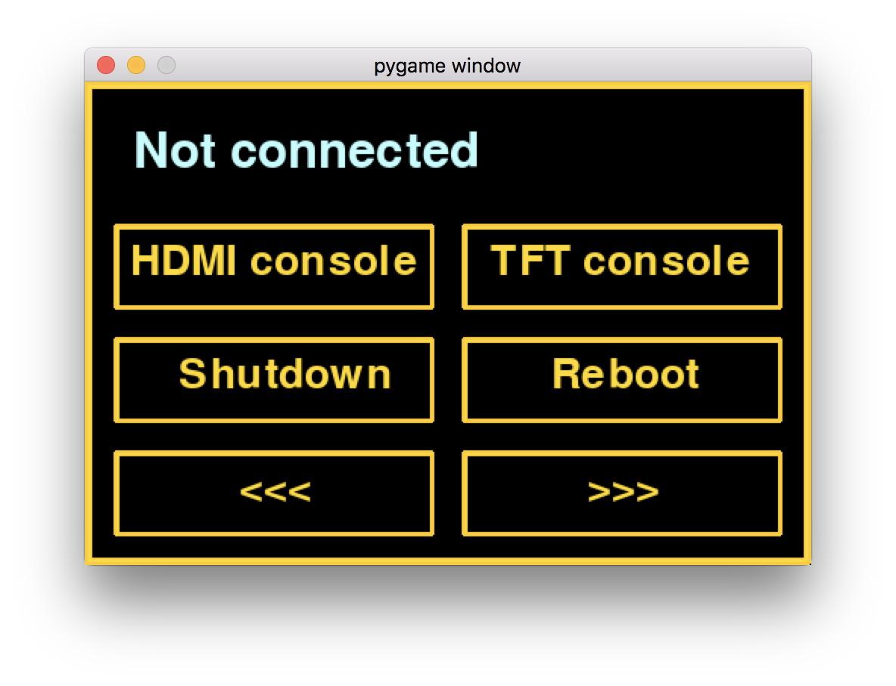
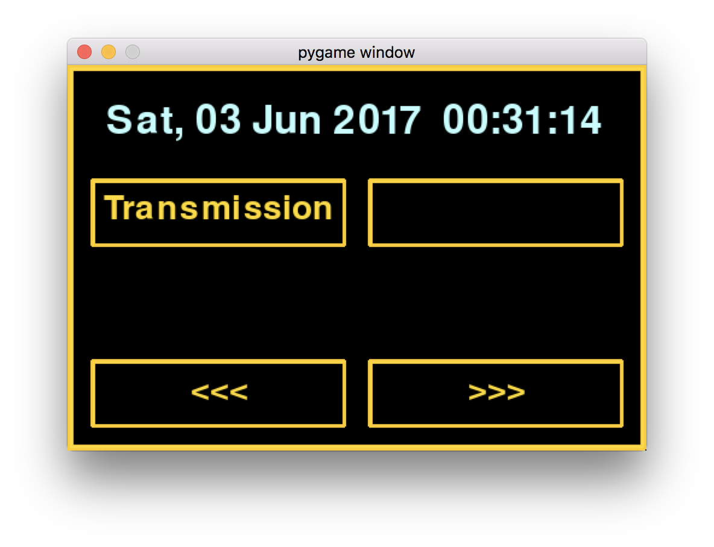
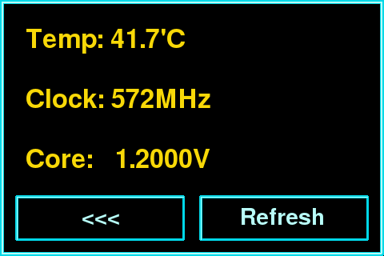

# Raspberry Pi TFT menu #
A simple Raspberry Pi menu that can be used with 3.5-inch TFT touch display.

## Usage ##
1. Clone this repository
    ```
    git clone https://github.com/So-Cool/rPiTFT.git /home/pi/pitftmenu
    ```

2. Add a cron job to run the menu at system bootup
    ```
    mkdir logs
    sudo crontab -e

    # Add the line below
    @reboot sh /home/pi/pitftmenu/menu.sh >/home/pi/logs/cronlog 2>&1
    ```

3. Make sure that the menu is run when logging out of bash
    ```
    vim ~/.bash_logout

    # The structure of the file should be as follows
    if [ "$SHLVL" = 1 ]; then
        #...
        sudo /home/pi/pitftmenu/menu.sh
        #...
    fi
    ```

## Screenshots ##
### `01_menu_run.py` ###

### `02_menu_system.py` ###

### `03_menu_services.py` ###

### `04_menu_stats.py` ###


## Caveats ##
To test your screen run:
```
sudo FRAMEBUFFER=/dev/fb1 startx"

```

### Configure Waveshare 3.5inch RPi LCD ###
Manufacturer's guide can be found [here](http://www.waveshare.com/wiki/3.5inch_RPi_LCD_(A)).  
The drivers are available [here](http://www.waveshare.com/w/upload/7/74/LCD-show-170309.tar.gz). To install them do:
```
wget http://www.waveshare.com/w/upload/4/4b/LCD-show-161112.tar.gz
tar xvf LCD-show-*.tar.gz
```

Then configure Xorg and calibrate & rotates the touchscreen
```
cd LCD-show-*
sudo mkdir /etc/X11/xorg.conf.d
sudo cp -rf ./LCD-show/etc/X11/xorg.conf.d/99-calibration.conf-35-180  /etc/X11/xorg.conf.d/99-calibration.conf
```

To force Xorg to run on the TFT (`/dev/fb0` is HDMI and  `/dev/fb1` is TFT):
```
sudo cp -rf ./LCD-show/usr/share/X11/xorg.conf.d/99-fbturbo.conf  /usr/share/X11/xorg.conf.d/
sudo mv /usr/share/X11/xorg.conf.d/99-fbturbo.conf ~

# Update /etc/inittab
#sudo cp ./LCD-show/inittab /etc/

# Kernel modules
sudo cp ./LCD-show/waveshare35a-overlay.dtb /boot/overlays/waveshare35a.dtbo
sudo cp ./LCD-show/waveshare35a-overlay.dtb /boot/overlays/

# Clean the temporary files
rm -fr ./LCD-show
```

Boot configuration
```
sudo echo "
dtparam=i2c_arm=on
dtparam=spi=on
enable_uart=1

# Enable audio (loads snd_bcm2835)
dtparam=audio=on
dtoverlay=waveshare35a:rotate=270
dtoverlay=ads7846,cs=1,penirq=17,penirq_pull=2,speed=1000000,keep_vref_on=1,swapxy=1,pmax=255,xohms=60,xmin=200,xmax=3900,ymin=200,ymax=3900
" >> /boot/config.txt
```

Command line configuration
```
#fbcon=map:10 -- transfers the console to the screen
#sudo echo " fbcon=map:10 fbcon=font:ProFont6x11 logo.nologo" >> /boot/cmdline.txt
```

Finally tocuch screen is broken on debian Jessy due to SDL2.x library bug. You can downgrade it following the instructions outlined [here](https://learn.adafruit.com/adafruit-2-4-pitft-hat-with-resistive-touchscreen-mini-kit/pitft-pygame-tips).

You can alos downgrade SDL to 1.2 by executing attached script:
```
sudo ./fix_sdl.sh
```

If you want to symlink the touch panel to `/dev/touchscreen` do (more info [here](https://github.com/notro/fbtft/wiki/FBTFT-on-Raspian#tslib-sdl-pygame)):
```
sudo echo 'SUBSYSTEM=="input", KERNEL=="event[0-9]*", ATTRS{name}=="ADS7846*", SYMLINK+="input/touchscreen"' >> /etc/udev/rules.d/95-ads7846.rules
```

If you want to turn off the console blanking do:
```
# https://learn.adafruit.com/adafruit-pitft-3-dot-5-touch-screen-for-raspberry-pi?view=all#turn-off-console-blanking
```

### Touchscreen calibration ##
#### From terminal ####
```
sudo apt-get install evtest tslib libts-bin
#sudo evtest /dev/input/event2
sudo TSLIB_FBDEVICE=/dev/fb1 TSLIB_TSDEVICE=/dev/input/event2 ts_calibrate
sudo TSLIB_FBDEVICE=/dev/fb1 TSLIB_TSDEVICE=/dev/input/event2 ts_test
```

#### From X ####
```
sudo apt-get install -y xinput-calibrator
#sudo rm /etc/X11/xorg.conf.d/99-calibration.conf
#FRAMEBUFFER=/dev/fb1 startx & DISPLAY=:0.0 xinput_calibrator
#echo "sudo nano /etc/X11/xorg.conf.d/99-calibration.conf and copy the output"
```
